<div align="left" style="position: relative;">
<h1>FORO-HUB-API</h1>
<p align="left">
	<em><code>❯ API REST para la gestión de tópicos en un foro, desarrollada con Spring, Java y MySQL. </code></em>
</p>
<p align="left">
	
	
	
	
</p>
<p align="left">Built with the tools and technologies:</p>
<p align="left">
	
    
    
    
</p>
</div>
<br clear="right">

<details><summary>Table of Contents</summary>

- [📍 Overview](#-overview)
- [👾 Features](#-features)
- [📁 Project Structure](#-project-structure)
    - [📂 Project Index](#-project-index)
- [🚀 Getting Started](#-getting-started)
    - [☑️ Prerequisites](#-prerequisites)
    - [⚙️ Installation](#-installation)
    - [🤖 Usage](#🤖-usage)
    - [🧪 Testing](#🧪-testing)
- [📌 Project Roadmap](#-project-roadmap)
- [🔰 Contributing](#-contributing)
- [🎗 License](#-license)
- [🙌 Acknowledgments](#-acknowledgments)

</details>
<hr>

## 📍 Overview

<code>❯ Esta API REST permite la gestión de tópicos en un foro. Los usuarios pueden crear, leer, actualizar y eliminar tópicos. La API está desarrollada con Spring Boot y utiliza MySQL como base de datos. La seguridad se maneja mediante tokens JWT.</code>

---

## 👾 Features


<code>❯ User authentication y authorization usando JWT.</code>

<code>❯ Operaciones CRUD para usuarios, perfiles, topicos y respuestas.</code>

<code>❯ Manejo de errores personalizado.</code>

<code>❯ Migraciones de base de datos con Flyway.</code>

<code>❯ Encriptación de contraseñas con BCrypt.</code>

<code>❯ Gestión de sesiones sin estado.</code>

<code>❯ API Documentation with Swagger/OpenAPI.</code>

<code>❯ Unit and Integration Testing with JUnit.</code>

<code>❯ Role-based Access Control (RBAC).</code>

<code>❯ Pagination and Sorting for API endpoints.</code>

<code>❯ Data Validation with Jakarta Bean Validation.</code>

<code>❯ Exception Handling with Custom Error Responses.</code>


---

## 📸 Screenshots

### Endpoint Responses

<details open>

<summary>Topicos</summary>

##### \`GET /topicos\`
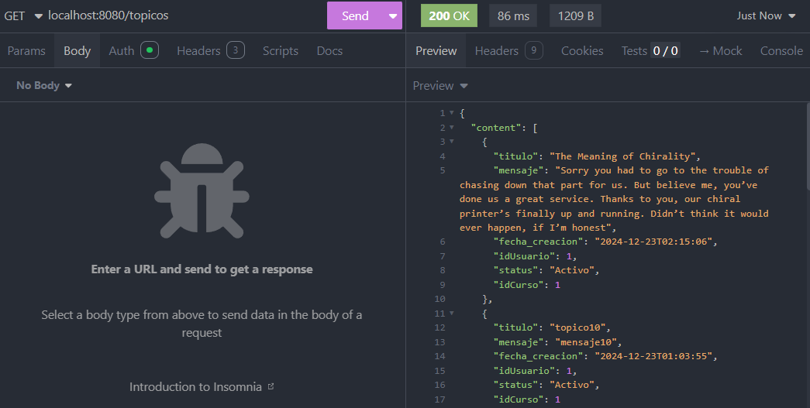

##### \`POST /topicos\`
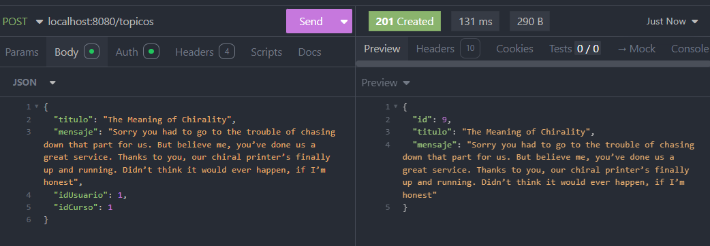

##### \`PUT /topicos/{id}\`
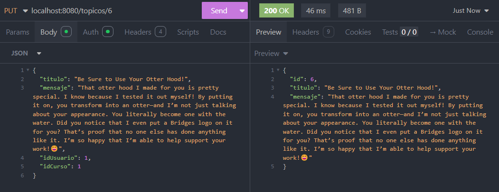

##### \`DELETE /topicos/{id}\`
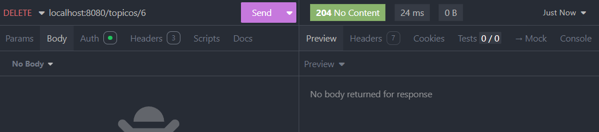
</details>

<details close>

<summary>Usuarios</summary>

##### \`GET /usuarios\`
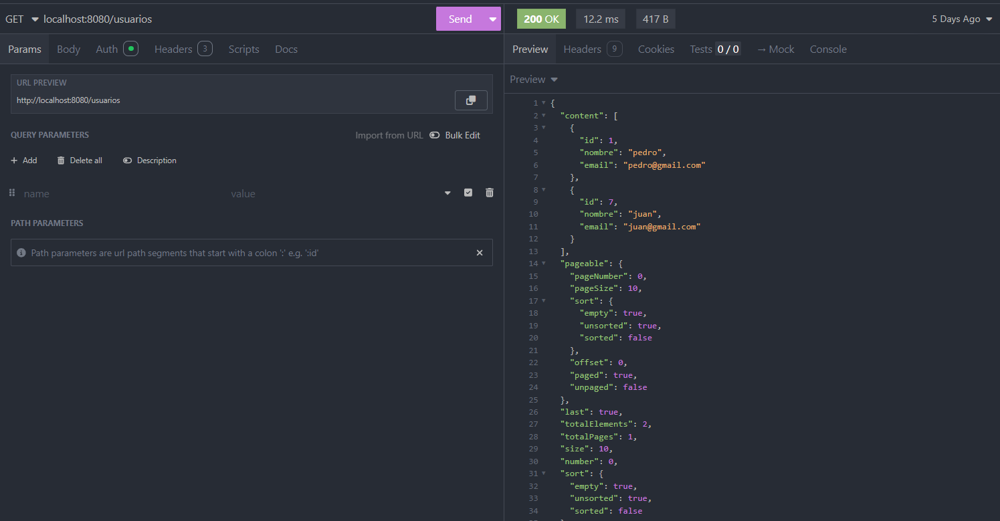

##### \`POST /usuarios\`
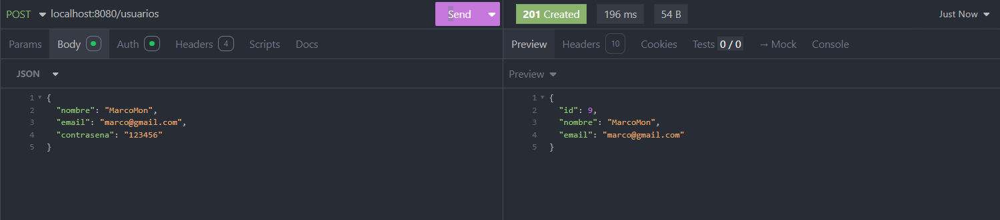

##### \`PUT /usuarios/{id}\`
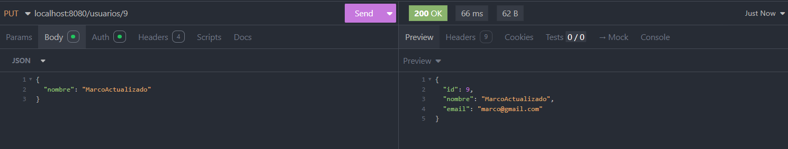

##### \`DELETE /usuarios/{id}\`
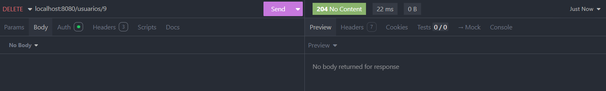
</details>

<details close>

<summary>Perfiles</summary>

##### \`GET /perfiles\`
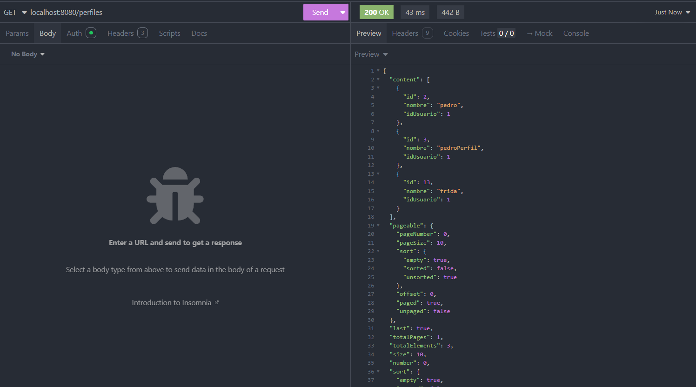

##### \`POST /perfiles\`
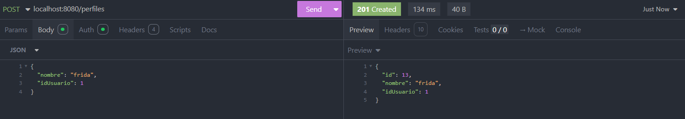

##### \`PUT /perfiles/{id}\`
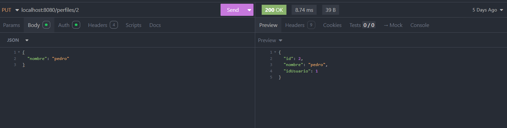

##### \`DELETE /perfiles/{id}\`
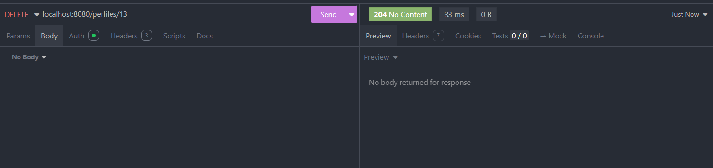
</details>

<details close>

<summary>Respuestas</summary>

##### \`GET /respuestas\`
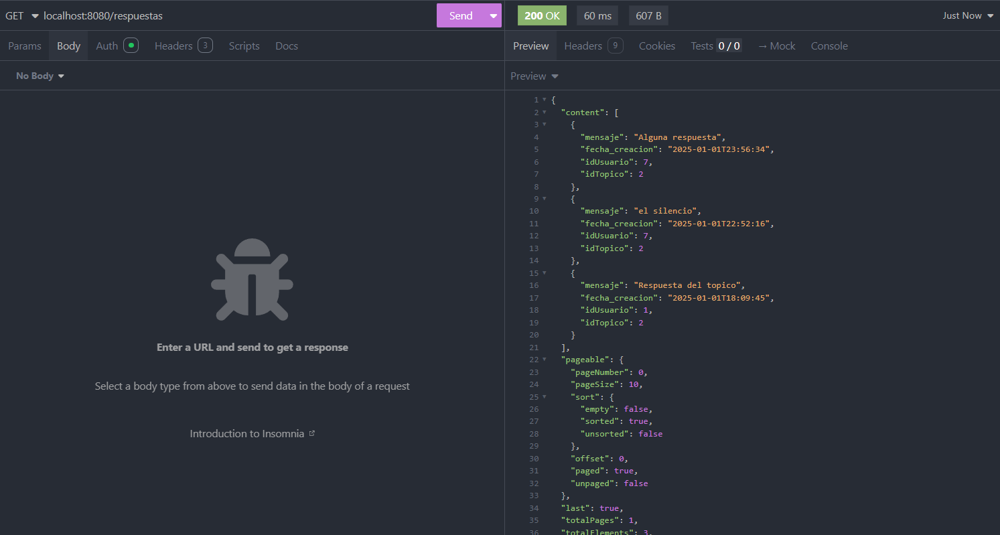

##### \`POST /respuestas\`
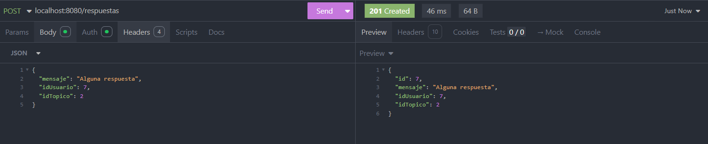

##### \`PUT /respuestas/{id}\`
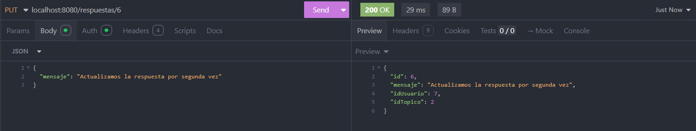

##### \`DELETE /respuestas/{id}\`
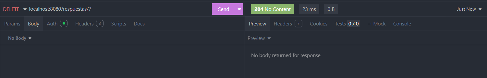
</details>

## 📁 Project Structure

```sh
└── foro-hub-api/
    ├── README.md
    ├── mvnw
    ├── mvnw.cmd
    ├── pom.xml
    └── src
        ├── main
        │   ├── java
        │   │   └── foro
        │   │       └── hub
        │   └── resources
        │       ├── application.properties
        │       └── db
        │           └── migration
        └── test
            └── java
                └── foro
                    └── hub
```


### 📂 Project Index
<details open>
	<summary><b><code>FORO-HUB-API/</code></b></summary>
	<details> <!-- __root__ Submodule -->
		<summary><b>__root__</b></summary>
		<blockquote>
			<table>
			<tr>
				<td><b><a href='https://github.com/JosueVazqJim/foro-hub-api/blob/master/mvnw'>mvnw</a></b></td>
				<td><code>❯ REPLACE-ME</code></td>
			</tr>
			<tr>
				<td><b><a href='https://github.com/JosueVazqJim/foro-hub-api/blob/master/mvnw.cmd'>mvnw.cmd</a></b></td>
				<td><code>❯ REPLACE-ME</code></td>
			</tr>
			</table>
		</blockquote>
	</details>
	<details> <!-- src Submodule -->
		<summary><b>src</b></summary>
		<blockquote>
			<details>
				<summary><b>main</b></summary>
				<blockquote>
					<details>
						<summary><b>resources</b></summary>
						<blockquote>
							<details>
								<summary><b>db</b></summary>
								<blockquote>
									<details>
										<summary><b>migration</b></summary>
										<blockquote>
											<table>
											<tr>
												<td><b><a href='https://github.com/JosueVazqJim/foro-hub-api/blob/master/src/main/resources/db/migration/V4__create-table-topicos.sql'>V4__create-table-topicos.sql</a></b></td>
												<td><code>❯ REPLACE-ME</code></td>
											</tr>
											<tr>
												<td><b><a href='https://github.com/JosueVazqJim/foro-hub-api/blob/master/src/main/resources/db/migration/V6__alter-table-topicos-add-foreign-key.sql'>V6__alter-table-topicos-add-foreign-key.sql</a></b></td>
												<td><code>❯ REPLACE-ME</code></td>
											</tr>
											<tr>
												<td><b><a href='https://github.com/JosueVazqJim/foro-hub-api/blob/master/src/main/resources/db/migration/V10__alter-table-usuarios-change-name-email-column.sql'>V10__alter-table-usuarios-change-name-email-column.sql</a></b></td>
												<td><code>❯ REPLACE-ME</code></td>
											</tr>
											<tr>
												<td><b><a href='https://github.com/JosueVazqJim/foro-hub-api/blob/master/src/main/resources/db/migration/V3__create-table-cursos.sql'>V3__create-table-cursos.sql</a></b></td>
												<td><code>❯ REPLACE-ME</code></td>
											</tr>
											<tr>
												<td><b><a href='https://github.com/JosueVazqJim/foro-hub-api/blob/master/src/main/resources/db/migration/V1__create-table-usuarios.sql'>V1__create-table-usuarios.sql</a></b></td>
												<td><code>❯ REPLACE-ME</code></td>
											</tr>
											<tr>
												<td><b><a href='https://github.com/JosueVazqJim/foro-hub-api/blob/master/src/main/resources/db/migration/V11__alter-table-topicos-change-name-fecha-column.sql'>V11__alter-table-topicos-change-name-fecha-column.sql</a></b></td>
												<td><code>❯ REPLACE-ME</code></td>
											</tr>
											<tr>
												<td><b><a href='https://github.com/JosueVazqJim/foro-hub-api/blob/master/src/main/resources/db/migration/V8__alter-table-respuestas-add-foreign-key-usuarios.sql'>V8__alter-table-respuestas-add-foreign-key-usuarios.sql</a></b></td>
												<td><code>❯ REPLACE-ME</code></td>
											</tr>
											<tr>
												<td><b><a href='https://github.com/JosueVazqJim/foro-hub-api/blob/master/src/main/resources/db/migration/V2__create-table-perfiles.sql'>V2__create-table-perfiles.sql</a></b></td>
												<td><code>❯ REPLACE-ME</code></td>
											</tr>
											<tr>
												<td><b><a href='https://github.com/JosueVazqJim/foro-hub-api/blob/master/src/main/resources/db/migration/V9__alter-all-tables-add-column-eliminado.sql'>V9__alter-all-tables-add-column-eliminado.sql</a></b></td>
												<td><code>❯ REPLACE-ME</code></td>
											</tr>
											<tr>
												<td><b><a href='https://github.com/JosueVazqJim/foro-hub-api/blob/master/src/main/resources/db/migration/V7__alter-table-respuestas-add-foreign-key.sql'>V7__alter-table-respuestas-add-foreign-key.sql</a></b></td>
												<td><code>❯ REPLACE-ME</code></td>
											</tr>
											<tr>
												<td><b><a href='https://github.com/JosueVazqJim/foro-hub-api/blob/master/src/main/resources/db/migration/V5__create-table-respuestas.sql'>V5__create-table-respuestas.sql</a></b></td>
												<td><code>❯ REPLACE-ME</code></td>
											</tr>
											</table>
										</blockquote>
									</details>
								</blockquote>
							</details>
						</blockquote>
					</details>
					<details>
						<summary><b>java</b></summary>
						<blockquote>
							<details>
								<summary><b>foro</b></summary>
								<blockquote>
									<details>
										<summary><b>hub</b></summary>
										<blockquote>
											<details>
												<summary><b>api</b></summary>
												<blockquote>
													<table>
													<tr>
														<td><b><a href='https://github.com/JosueVazqJim/foro-hub-api/blob/master/src/main/java/foro/hub/api/ApiApplication.java'>ApiApplication.java</a></b></td>
														<td><code>❯ REPLACE-ME</code></td>
													</tr>
													</table>
													<details>
														<summary><b>infra</b></summary>
														<blockquote>
															<details>
																<summary><b>errores</b></summary>
																<blockquote>
																	<table>
																	<tr>
																		<td><b><a href='https://github.com/JosueVazqJim/foro-hub-api/blob/master/src/main/java/foro/hub/api/infra/errores/TratadorErrores.java'>TratadorErrores.java</a></b></td>
																		<td><code>❯ REPLACE-ME</code></td>
																	</tr>
																	</table>
																</blockquote>
															</details>
															<details>
																<summary><b>security</b></summary>
																<blockquote>
																	<table>
																	<tr>
																		<td><b><a href='https://github.com/JosueVazqJim/foro-hub-api/blob/master/src/main/java/foro/hub/api/infra/security/TokenService.java'>TokenService.java</a></b></td>
																		<td><code>❯ REPLACE-ME</code></td>
																	</tr>
																	<tr>
																		<td><b><a href='https://github.com/JosueVazqJim/foro-hub-api/blob/master/src/main/java/foro/hub/api/infra/security/AutenticacionService.java'>AutenticacionService.java</a></b></td>
																		<td><code>❯ REPLACE-ME</code></td>
																	</tr>
																	<tr>
																		<td><b><a href='https://github.com/JosueVazqJim/foro-hub-api/blob/master/src/main/java/foro/hub/api/infra/security/SecurityFilter.java'>SecurityFilter.java</a></b></td>
																		<td><code>❯ REPLACE-ME</code></td>
																	</tr>
																	<tr>
																		<td><b><a href='https://github.com/JosueVazqJim/foro-hub-api/blob/master/src/main/java/foro/hub/api/infra/security/SecurityConfigurations.java'>SecurityConfigurations.java</a></b></td>
																		<td><code>❯ REPLACE-ME</code></td>
																	</tr>
																	<tr>
																		<td><b><a href='https://github.com/JosueVazqJim/foro-hub-api/blob/master/src/main/java/foro/hub/api/infra/security/DatosJWTToken.java'>DatosJWTToken.java</a></b></td>
																		<td><code>❯ REPLACE-ME</code></td>
																	</tr>
																	</table>
																</blockquote>
															</details>
														</blockquote>
													</details>
													<details>
														<summary><b>domain</b></summary>
														<blockquote>
															<table>
															<tr>
																<td><b><a href='https://github.com/JosueVazqJim/foro-hub-api/blob/master/src/main/java/foro/hub/api/domain/ValidacionException.java'>ValidacionException.java</a></b></td>
																<td><code>❯ REPLACE-ME</code></td>
															</tr>
															<tr>
																<td><b><a href='https://github.com/JosueVazqJim/foro-hub-api/blob/master/src/main/java/foro/hub/api/domain/UsuarioInvalido.java'>UsuarioInvalido.java</a></b></td>
																<td><code>❯ REPLACE-ME</code></td>
															</tr>
															</table>
															<details>
																<summary><b>perfil</b></summary>
																<blockquote>
																	<table>
																	<tr>
																		<td><b><a href='https://github.com/JosueVazqJim/foro-hub-api/blob/master/src/main/java/foro/hub/api/domain/perfil/DatosRegistroUsuario.java'>DatosRegistroUsuario.java</a></b></td>
																		<td><code>❯ REPLACE-ME</code></td>
																	</tr>
																	<tr>
																		<td><b><a href='https://github.com/JosueVazqJim/foro-hub-api/blob/master/src/main/java/foro/hub/api/domain/perfil/Usuario.java'>Usuario.java</a></b></td>
																		<td><code>❯ REPLACE-ME</code></td>
																	</tr>
																	<tr>
																		<td><b><a href='https://github.com/JosueVazqJim/foro-hub-api/blob/master/src/main/java/foro/hub/api/domain/perfil/DatosAutenticacionUsuario.java'>DatosAutenticacionUsuario.java</a></b></td>
																		<td><code>❯ REPLACE-ME</code></td>
																	</tr>
																	<tr>
																		<td><b><a href='https://github.com/JosueVazqJim/foro-hub-api/blob/master/src/main/java/foro/hub/api/domain/perfil/UsuarioRepository.java'>UsuarioRepository.java</a></b></td>
																		<td><code>❯ REPLACE-ME</code></td>
																	</tr>
																	</table>
																</blockquote>
															</details>
															<details>
																<summary><b>curso</b></summary>
																<blockquote>
																	<table>
																	<tr>
																		<td><b><a href='https://github.com/JosueVazqJim/foro-hub-api/blob/master/src/main/java/foro/hub/api/domain/curso/Curso.java'>Curso.java</a></b></td>
																		<td><code>❯ REPLACE-ME</code></td>
																	</tr>
																	<tr>
																		<td><b><a href='https://github.com/JosueVazqJim/foro-hub-api/blob/master/src/main/java/foro/hub/api/domain/curso/Categoria.java'>Categoria.java</a></b></td>
																		<td><code>❯ REPLACE-ME</code></td>
																	</tr>
																	<tr>
																		<td><b><a href='https://github.com/JosueVazqJim/foro-hub-api/blob/master/src/main/java/foro/hub/api/domain/curso/DatosRegistroCurso.java'>DatosRegistroCurso.java</a></b></td>
																		<td><code>❯ REPLACE-ME</code></td>
																	</tr>
																	<tr>
																		<td><b><a href='https://github.com/JosueVazqJim/foro-hub-api/blob/master/src/main/java/foro/hub/api/domain/curso/CursoRepository.java'>CursoRepository.java</a></b></td>
																		<td><code>❯ REPLACE-ME</code></td>
																	</tr>
																	</table>
																</blockquote>
															</details>
															<details>
																<summary><b>topico</b></summary>
																<blockquote>
																	<table>
																	<tr>
																		<td><b><a href='https://github.com/JosueVazqJim/foro-hub-api/blob/master/src/main/java/foro/hub/api/domain/topico/LogicaTopico.java'>LogicaTopico.java</a></b></td>
																		<td><code>❯ REPLACE-ME</code></td>
																	</tr>
																	<tr>
																		<td><b><a href='https://github.com/JosueVazqJim/foro-hub-api/blob/master/src/main/java/foro/hub/api/domain/topico/DatosRegistroTopico.java'>DatosRegistroTopico.java</a></b></td>
																		<td><code>❯ REPLACE-ME</code></td>
																	</tr>
																	<tr>
																		<td><b><a href='https://github.com/JosueVazqJim/foro-hub-api/blob/master/src/main/java/foro/hub/api/domain/topico/Topico.java'>Topico.java</a></b></td>
																		<td><code>❯ REPLACE-ME</code></td>
																	</tr>
																	<tr>
																		<td><b><a href='https://github.com/JosueVazqJim/foro-hub-api/blob/master/src/main/java/foro/hub/api/domain/topico/DatosListadoTopicos.java'>DatosListadoTopicos.java</a></b></td>
																		<td><code>❯ REPLACE-ME</code></td>
																	</tr>
																	<tr>
																		<td><b><a href='https://github.com/JosueVazqJim/foro-hub-api/blob/master/src/main/java/foro/hub/api/domain/topico/DatosActualizarTopico.java'>DatosActualizarTopico.java</a></b></td>
																		<td><code>❯ REPLACE-ME</code></td>
																	</tr>
																	<tr>
																		<td><b><a href='https://github.com/JosueVazqJim/foro-hub-api/blob/master/src/main/java/foro/hub/api/domain/topico/TopicoRepository.java'>TopicoRepository.java</a></b></td>
																		<td><code>❯ REPLACE-ME</code></td>
																	</tr>
																	<tr>
																		<td><b><a href='https://github.com/JosueVazqJim/foro-hub-api/blob/master/src/main/java/foro/hub/api/domain/topico/DatosResTopico.java'>DatosResTopico.java</a></b></td>
																		<td><code>❯ REPLACE-ME</code></td>
																	</tr>
																	</table>
																	<details>
																		<summary><b>validaciones</b></summary>
																		<blockquote>
																			<table>
																			<tr>
																				<td><b><a href='https://github.com/JosueVazqJim/foro-hub-api/blob/master/src/main/java/foro/hub/api/domain/topico/validaciones/IValidadoresTopicos.java'>IValidadoresTopicos.java</a></b></td>
																				<td><code>❯ REPLACE-ME</code></td>
																			</tr>
																			<tr>
																				<td><b><a href='https://github.com/JosueVazqJim/foro-hub-api/blob/master/src/main/java/foro/hub/api/domain/topico/validaciones/ValidadorDuplicados.java'>ValidadorDuplicados.java</a></b></td>
																				<td><code>❯ REPLACE-ME</code></td>
																			</tr>
																			</table>
																		</blockquote>
																	</details>
																</blockquote>
															</details>
														</blockquote>
													</details>
													<details>
														<summary><b>controller</b></summary>
														<blockquote>
															<table>
															<tr>
																<td><b><a href='https://github.com/JosueVazqJim/foro-hub-api/blob/master/src/main/java/foro/hub/api/controller/AutenticacionController.java'>AutenticacionController.java</a></b></td>
																<td><code>❯ REPLACE-ME</code></td>
															</tr>
															<tr>
																<td><b><a href='https://github.com/JosueVazqJim/foro-hub-api/blob/master/src/main/java/foro/hub/api/controller/TopicoController.java'>TopicoController.java</a></b></td>
																<td><code>❯ REPLACE-ME</code></td>
															</tr>
															<tr>
																<td><b><a href='https://github.com/JosueVazqJim/foro-hub-api/blob/master/src/main/java/foro/hub/api/controller/HelloController.java'>HelloController.java</a></b></td>
																<td><code>❯ REPLACE-ME</code></td>
															</tr>
															</table>
														</blockquote>
													</details>
												</blockquote>
											</details>
										</blockquote>
									</details>
								</blockquote>
							</details>
						</blockquote>
					</details>
				</blockquote>
			</details>
			<details>
				<summary><b>test</b></summary>
				<blockquote>
					<details>
						<summary><b>java</b></summary>
						<blockquote>
							<details>
								<summary><b>foro</b></summary>
								<blockquote>
									<details>
										<summary><b>hub</b></summary>
										<blockquote>
											<details>
												<summary><b>api</b></summary>
												<blockquote>
													<table>
													<tr>
														<td><b><a href='https://github.com/JosueVazqJim/foro-hub-api/blob/master/src/test/java/foro/hub/api/ApiApplicationTests.java'>ApiApplicationTests.java</a></b></td>
														<td><code>❯ REPLACE-ME</code></td>
													</tr>
													</table>
												</blockquote>
											</details>
										</blockquote>
									</details>
								</blockquote>
							</details>
						</blockquote>
					</details>
				</blockquote>
			</details>
		</blockquote>
	</details>
</details>

---
## 🚀 Getting Started

### ☑️ Prerequisites

Antes de comenzar a utilizar foro-hub-api, asegúrese de que su entorno de ejecución cumpla con los siguientes requisitos:

- **Programming Language:** Java


### ⚙️ Installation

Install foro-hub-api using one of the following methods:

**Build from source:**

1. Clone the foro-hub-api repository:
```sh
❯ git clone https://github.com/JosueVazqJim/foro-hub-api
```

2. Navigate to the project directory:
```sh
❯ cd foro-hub-api
```

3. Install the project dependencies:

```sh
❯ ./mvnw install
```


### 🤖 Usage
Run foro-hub-api using the following command:
```sh
❯ ./mvnw spring-boot:run
```

## 🔰 Contributing

- **💬 [Join the Discussions](https://github.com/JosueVazqJim/foro-hub-api/discussions)**: Share your insights, provide feedback, or ask questions.
- **🐛 [Report Issues](https://github.com/JosueVazqJim/foro-hub-api/issues)**: Submit bugs found or log feature requests for the `foro-hub-api` project.
- **💡 [Submit Pull Requests](https://github.com/JosueVazqJim/foro-hub-api/blob/main/CONTRIBUTING.md)**: Review open PRs, and submit your own PRs.

<details closed>
<summary>Contributing Guidelines</summary>

1. **Fork the Repository**: Start by forking the project repository to your github account.
2. **Clone Locally**: Clone the forked repository to your local machine using a git client.
   ```sh
   git clone https://github.com/JosueVazqJim/foro-hub-api
   ```
3. **Create a New Branch**: Always work on a new branch, giving it a descriptive name.
   ```sh
   git checkout -b new-feature-x
   ```
4. **Make Your Changes**: Develop and test your changes locally.
5. **Commit Your Changes**: Commit with a clear message describing your updates.
   ```sh
   git commit -m 'Implemented new feature x.'
   ```
6. **Push to github**: Push the changes to your forked repository.
   ```sh
   git push origin new-feature-x
   ```
7. **Submit a Pull Request**: Create a PR against the original project repository. Clearly describe the changes and their motivations.
8. **Review**: Once your PR is reviewed and approved, it will be merged into the main branch. Congratulations on your contribution!
</details>

<details open>
<summary>Contributor Graph</summary>
<br>
<p align="left">
   <a href="https://github.com{/JosueVazqJim/foro-hub-api/}graphs/contributors">
      
   </a>
</p>
</details>

---

